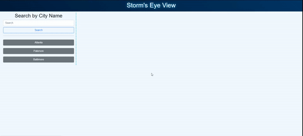

# Storm's Eye View

## Description

Storm's Eye View is a weather forecasting site that finds what the weather in an area will look like for the next several days. Whether it is planning for an upcoming trip or just preparing for the upcoming week, Storm's Eye View will work for you.

This application gave provided an opportunity to familiarize with using APIs and how to store and access the data to hit its end points. It was also my first time utilizing Bootstrap, a CSS framework. It was quite the useful tool for get my front-end formatted. I look forward to the next opportunity to play with both.

Maybe you two would like to [check out]() the whether in city near you. 

## Usage

Provide instructions and examples for use. Include screenshots as needed.

To add a screenshot, create an `assets/images` folder in your repository and upload your screenshot to it. Then, using the relative file path, add it to your README using the following syntax:

## Credits

Shoutout to Leon and Anthony for assisting me with working through my thoughts around formatting the data and organizing my code!

[Anthony Cedrone](https://github.com/antced)
[Leon Forsythe](https://media3.giphy.com/media/dXWVBJojZb4bGCQLKF/giphy.gif?cid=790b761144f687fe4bd3e49c73b5484dbe1ab0d8730ddfd2&rid=giphy.gif&ct=g)

## License

[MIT License](https://github.com/JPauldo/storms-eye-view/blob/main/LICENSE).
